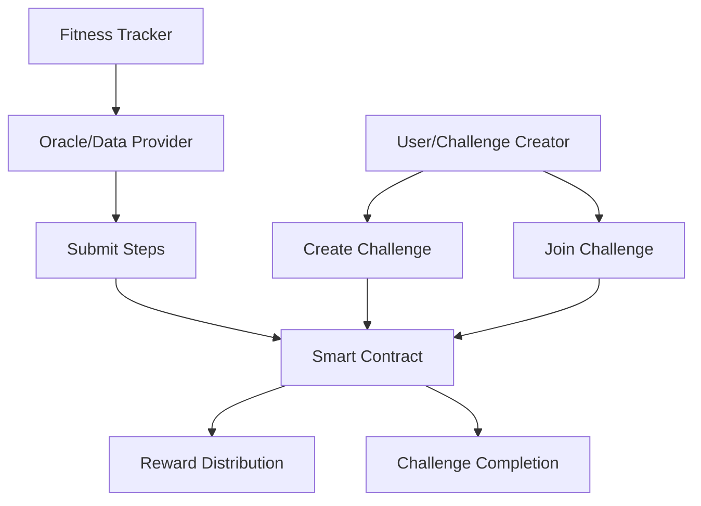

# PulseStride Step Challenge

A decentralized platform for participating in global step-counting challenges and virtual marathons on the Stacks blockchain.

## Overview

PulseStride enables users to participate in transparent, blockchain-based fitness competitions by:
- Creating or joining step-counting challenges
- Submitting verified step counts through authorized fitness tracker integrations
- Earning rewards based on performance and participation
- Competing in a trustless, transparent environment

The platform supports both public and private challenges, customizable reward structures, and automated prize distribution.

## Architecture

PulseStride is built around a core smart contract that manages challenge creation, participation, and reward distribution.



### Core Components
- Challenge Management System
- Participant Registry
- Step Submission Verification
- Reward Distribution Mechanism
- Oracle Integration for Data Validation

## Contract Documentation

### Pulse-Stride Contract

The main contract managing all platform functionality.

#### Key Features
- Challenge creation with customizable parameters
- User registration and participation tracking
- Step count validation and recording
- Anti-cheating mechanisms
- Automated reward distribution
- Oracle integration for data verification

### Access Control
- Contract Owner: Can manage data providers and system parameters
- Challenge Creators: Can create and manage their challenges
- Data Providers: Authorized to submit verified step counts
- Participants: Can join challenges and receive rewards

## Getting Started

### Prerequisites
- Clarinet
- Stacks wallet
- Access to authorized data provider

### Basic Usage

1. Creating a Challenge:
```clarity
(contract-call? .pulse-stride create-challenge 
    "30 Day Challenge"    ;; name
    "Walk 10k steps/day"  ;; description
    u100000              ;; start-block
    u104320              ;; end-block
    u1000000             ;; entry-fee (in µSTX)
    u300000              ;; step-goal
    true                 ;; is-public
    u100                 ;; max-participants
    u500000              ;; first-place-percent
    u300000              ;; second-place-percent
    u150000              ;; third-place-percent
    u50000               ;; participation-percent
)
```

2. Joining a Challenge:
```clarity
(contract-call? .pulse-stride register-for-challenge u1)
```

## Function Reference

### Administrative Functions

```clarity
set-data-provider (provider principal) (authorized bool)
```
Sets or removes authorized data providers.

### Challenge Management

```clarity
create-challenge (name (string-ascii 50)) ...
register-for-challenge (challenge-id uint)
complete-challenge (challenge-id uint)
cancel-challenge (challenge-id uint)
```

### Step Submission

```clarity
submit-steps (challenge-id uint) (participant principal) (steps uint)
```

### Reward Distribution

```clarity
distribute-rewards (challenge-id uint)
```

### Read-Only Functions

```clarity
get-challenge (challenge-id uint)
get-participant-info (challenge-id uint) (participant principal)
get-daily-steps (challenge-id uint) (participant principal) (day uint)
get-challenge-reward-structure (challenge-id uint)
```

## Development

### Local Testing
1. Install Clarinet
2. Clone the repository
3. Run Clarinet tests:
```bash
clarinet test
```

### Deployment
1. Build contract:
```bash
clarinet build
```
2. Deploy to testnet/mainnet using Clarinet console or deployment scripts

## Security Considerations

### Limitations
- Maximum daily step limit of 50,000 steps
- Step submissions must be verified by authorized data providers
- One submission per participant per day
- Challenge parameters cannot be modified after creation

### Best Practices
- Always verify challenge parameters before joining
- Use only authorized data providers for step submission
- Ensure adequate STX balance for challenge entry fees
- Wait for transaction confirmation before considering actions final

### Anti-Cheating Measures
- Oracle validation of step data
- Daily submission limits
- Authorized provider verification
- Time-locked submissions